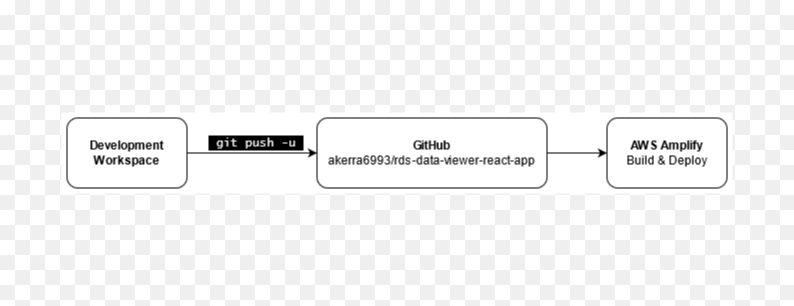
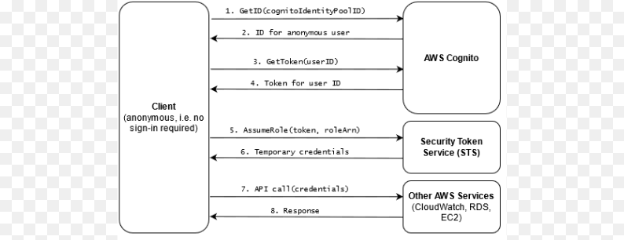

## Local Development

This project was bootstrapped with [Create React App](https://github.com/facebook/create-react-app).

To run the project locally, you can run:

### `npm start`

Runs the app in the development mode.\
Open [http://localhost:3000](http://localhost:3000) to view it in the browser.

The page will reload if you make edits.\
You will also see any lint errors in the console.

## Continuous Deployment

This application is hosted using [AWS Amplify](https://aws.amazon.com/amplify/). The Amplify project is configured to track the [GitHub Repository](https://github.com/akerra6993/rds-data-viewer-react-app). Commits to the `main` branch will automatically be built and deployed. See the Amplify project in AWS console for build settings and the hosted URL.



## Authentication and Permissions

This application uses [AWS Cognito](https://aws.amazon.com/cognito/) to generate an authentication token for anonymous (unauthenticated) users, then uses [AWS STS](https://docs.aws.amazon.com/STS/latest/APIReference/welcome.html) to generate temporary AWS credentials which allow the user to assume a certain IAM role. The role has policies attached which permit anyone assuming that role to perform certain actions.

The below diagram illustrates the authentication flow:



This is referred to as the "Basic (Classic) AuthFlow" for Cognito: https://docs.aws.amazon.com/cognito/latest/developerguide/authentication-flow.html. It is required for this app since RDS and EC2 APIs are not supported when using enhanced auth (see https://docs.aws.amazon.com/cognito/latest/developerguide/iam-roles.html).

### Required AWS API calls
The data sources for this application are:
* [RDS:DescribeDBInstances](https://docs.aws.amazon.com/AmazonRDS/latest/APIReference/API_DescribeDBInstances.html) (for the db instance data)
* [EC2:DescribeInstances](https://docs.aws.amazon.com/AWSEC2/latest/APIReference/API_DescribeInstances.html) (for ec2 instance data) 
* [CloudWatch:GetMetricData](https://docs.aws.amazon.com/AmazonCloudWatch/latest/APIReference/API_GetMetricData.html) (for CPU, connections, and RAM utilization metrics).

The IAM role assumed by the anonymous users (**Cognito_RDSDataAppPoolUnauth_Role**) must have the necessary access to these services to fetch the data. The permission is granted via policies attached to the role.

#### RDSDataPolicy
```json
{
    "Version": "2012-10-17",
    "Statement": [
        {
            "Sid": "VisualEditor0",
            "Effect": "Allow",
            "Action": "rds:DescribeDBInstances",
            "Resource": "*"
        }
    ]
}
```

#### EC2DataPolicy
```json
{
    "Version": "2012-10-17",
    "Statement": [
        {
            "Sid": "VisualEditor0",
            "Effect": "Allow",
            "Action": "ec2:DescribeInstances",
            "Resource": "*"
        }
    ]
}
```

#### CloudWatchGetMetricDataPolicy
```json
{
    "Version": "2012-10-17",
    "Statement": [
        {
            "Sid": "VisualEditor0",
            "Effect": "Allow",
            "Action": "cloudwatch:GetMetricData",
            "Resource": "*"
        }
    ]
}
```

## AWS Resource Summary

All required AWS resources for this project:

* Cognito Identity Pool
  * Allow unauthenticated access
  * Enable basic authentication flow

* Amplify Application
  * Framework = React
  * Track GitHub repository

* IAM Policies
  * RDSDataPolicy
  * EC2DataPolicy
  * CloudWatchGetMetricDataPolicy

* IAM Role: auto-created by Cognito (the UnAuth role)
    * Attach IAM policies listed above
    * Trust policy to allow unauthenticated Cognito identities to assume this role (this is automatically configured if the role is created by Cognito)